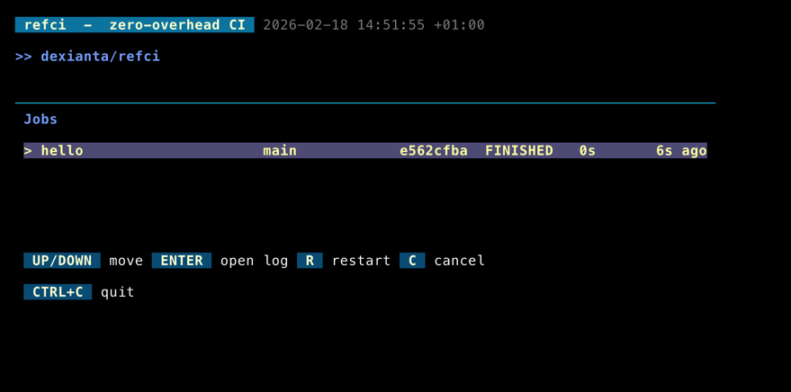
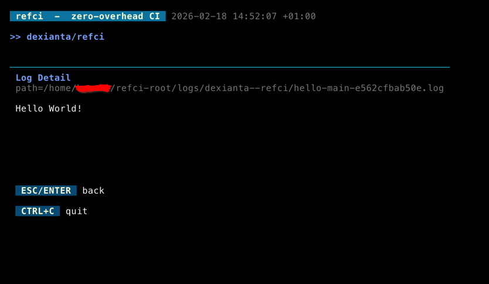

# refci

`refci` is a local CI runner for script-first workflows.

## TUI Preview

| Job list view | Log detail view |
| --- | --- |
|  |  |

## Why this exists

- [The Pain That is Github Actions](https://news.ycombinator.com/item?id=43419701)
- GitHub Actions YAML can be painful for small, branch/script-driven pipelines.
- A local, warm runtime is often faster and simpler than remote CI startup overhead.
  - especially coding agent can help you write these bash scripts nowadays, wouldn't you want something you can test more easily locally?
- I can't count the times that it takes absurd amount of time for the queue to pick up a job..

## How it works

### 1) Install

```bash
curl -fsSL https://raw.githubusercontent.com/dexianta/refci/main/install.sh | bash
```

Optional:

```bash
REFCI_REF=v0.1.0 curl -fsSL https://raw.githubusercontent.com/dexianta/refci/main/install.sh | bash
REFCI_INSTALL_DIR="$HOME/bin" curl -fsSL https://raw.githubusercontent.com/dexianta/refci/main/install.sh | bash
```

### 2) Initialize a root

```bash
refci init .
```

This creates:
- `refci.db`
- `repos/` (mirror repos)
- `worktrees/` (per-branch worktrees)
- `logs/` (job logs + per-repo CI activity log)

### 3) Clone a repo mirror

Generate a dedicated SSH keypair for the repo:

```bash
ssh-keygen -t ed25519 -f ~/.ssh/refci-owner-repo -C refci-owner-repo
```

Add `~/.ssh/refci-owner-repo.pub` as a deploy key in the GitHub repository settings for `owner/repo`.

After the deploy key is added, clone the mirror:

```bash
refci clone -i ~/.ssh/refci-owner-repo git@github.com:owner/repo.git
```

`refci clone` writes a managed host alias to `~/.ssh/config`, then stores the mirror's `origin` as `git@refci-owner--repo:owner/repo.git` so future fetches use the same deploy key.

### 4) Add job config to the repo

Create `.refci/conf.yml` in the repo (top-level dynamic map):

```yaml
main-test:
  branch_pattern: main
  path_patterns: []
  script: .refci/main.sh

feature-test:
  branch_pattern: feature-*
  path_patterns:
    - services/**
  script: .refci/feature.sh
```

Each key is the job name. `script` is repo-relative.

### 5) Run refci

From the refci root, run with the repo path:

```bash
refci -e .env ./repos/<repo-path>
```

To run several repositories in one process, create `config.yml`:

```yaml
backend:
  repo: ./repos/owner--backend
  env: ./backend.env
frontend:
  repo: ./repos/owner--frontend
  env: ./frontend.env
```

From the refci root, start all workers with one command:

```bash
refci config.yml
# Optional shared poll interval:
refci -interval 5s config.yml
```

Each named entry requires `repo` and `env`. Paths are relative to the current
refci root, just like the single-repo command; absolute paths also work. All
repositories must belong to that root. `.yml` and `.yaml` are supported.
Refci validates all env files and rejects duplicate repositories before starting.
Each repository has its own polling goroutine, env, runner, and CI activity log.
Fetch/poll errors retry independently. One shared TUI shows all repositories;
restart/cancel actions use the selected repository's worker and env. Repositories
outside the config remain visible, but cannot be restarted or canceled there.
Ctrl+C or SIGTERM stops every worker and its running jobs.

Disable automatic fetch/poll (manual `R`/`C` in TUI still works, and no `.env` is required):

```bash
refci --monitor ./repos/<repo-path>
```

From a refci root, run without arguments to monitor recent jobs across all repositories. Press `P` to open the repo picker:

```bash
refci
```

`.env` file format:
- one variable per line: `KEY=value`
- optional `export` prefix: `export KEY=value`
- blank lines and lines starting with `#` are ignored
- surrounding single or double quotes around values are supported

Example:

```dotenv
# runtime secrets
API_TOKEN=abc123
export AWS_REGION=us-east-1
GREETING="hello world"
```

Accepted repo target forms (path form recommended):
- `./repos/owner--repo`
- `/abs/path/to/repos/owner--repo`
- `owner--repo`

Worker lifecycle:
- `refci` starts the poll loop and job worker in-process.
- if `refci` exits, job polling/execution stops.

For daemon-style usage, run `refci` in `tmux`:

```bash
tmux new -d -s refci 'cd /path/to/refci-root && refci config.yml'
tmux attach -t refci
```

### 6) Runtime loop

Per interval (default `3s`):
1. `git fetch --prune origin` on mirror repo
2. load `.refci/conf.yml` from mirror `HEAD`
3. list branch heads
4. compare latest branch SHA with latest recorded job SHA
5. if changed (and path filter matches), queue run

Queued run behavior:
- create/reset branch worktree to target SHA
- run `bash <script>` in that worktree
- write stdout/stderr log under `logs/...`
- update `jobs` row in sqlite

If fetch/config/poll fails, refci keeps running, shows the error in the TUI, and retries on the next interval.
Internal runner activity is also appended to `logs/<repo>/ci.log` so you can inspect fetch/poll decisions separately from job output.

### 7) TUI

Jobs view:
- bare `refci` shows the latest 100 jobs across all repositories, most recent first
- the all-repositories view shows a color-coded `owner / repo` first column; choosing a repo from the picker filters the same view to that repo
- shows 20 jobs per page, including commit author
- `UP/DOWN`: select job
- `LEFT/RIGHT` or `PGUP/PGDOWN`: change page
- `ENTER`: open log detail (stream the last 200 line of the file each second)
- `L`: open CI activity log detail for the current repo, or the selected job's repo in the all-repositories view
- `R`: rerun when the latest attempt for that job/branch is failed
- `C`: cancel selected running/pending job
- `ESC` or `P` (job list): open the repo picker when launched with `refci`
- `ESC` or `ENTER` (detail): back
- `CTRL+C`: quit
